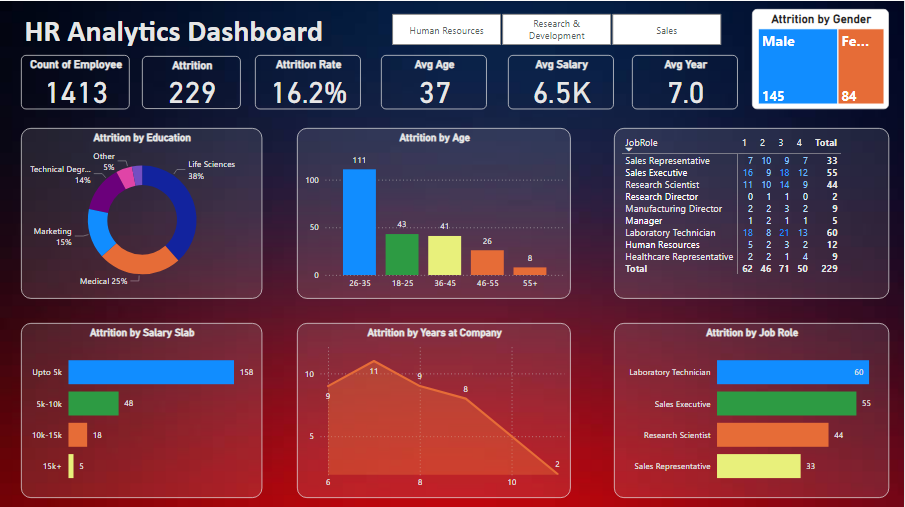

# HR Analytics Dashboard

This project provides an HR Analytics Dashboard designed using Power BI to visualize and analyze employee attrition data. The dashboard helps HR departments and management teams understand various factors contributing to employee attrition and make informed decisions to improve retention strategies.


## Features

- **Total Employee Count**: Displays the total number of employees.
- **Attrition Metrics**: Shows the number of employees who have left, the attrition rate, and other key metrics such as average age, average salary, and average tenure (years at the company).
- **Attrition by Education**: Pie chart showing attrition distribution based on education backgrounds.
- **Attrition by Age**: Bar chart representing attrition numbers across different age groups.
- **Attrition by Salary Slab**: Visualizes attrition based on salary ranges.
- **Attrition by Years at Company**: Line chart depicting attrition relative to the number of years employees have been with the company.
- **Attrition by Job Role**: Bar chart showing attrition numbers for different job roles.
- **Attrition by Gender**: Bar chart comparing male and female attrition rates.
- **Detailed Job Role Attrition**: Table providing a detailed view of attrition by job role over different time periods.

## Dashboard Overview

### Key Metrics
- **Count of Employee**: 1413
- **Attrition**: 229
- **Attrition Rate**: 16.2%
- **Avg Age**: 37
- **Avg Salary**: $6.5K
- **Avg Year**: 7.0

### Attrition Breakdown
- **By Education**:
  - Life Sciences: 38%
  - Medical: 25%
  - Marketing: 15%
  - Technical Degree: 14%
  - Other: 8%
  
- **By Age**:
  - 26-35: 111
  - 18-25: 43
  - 36-45: 41
  - 46-55: 26
  - 55+: 8

- **By Salary Slab**:
  - Up to 5k: 158
  - 5k-10k: 48
  - 10k-15k: 18
  - 15k+: 5

- **By Years at Company**:
  - 0-2 years: 10
  - 2-4 years: 11
  - 4-6 years: 9
  - 6-8 years: 6
  - 8-10 years: 8
  - 10+ years: 2

- **By Job Role**:
  - Laboratory Technician: 60
  - Sales Executive: 55
  - Research Scientist: 44
  - Sales Representative: 33

- **By Gender**:
  - Male: 145
  - Female: 84

### Job Role Attrition Details
- **Sales Representative**: 17 (Year 1), 9 (Year 2), 10 (Year 3), 7 (Year 4), 34 (Year 5) - Total: 55
- **Sales Executive**: 6 (Year 1), 19 (Year 2), 18 (Year 3), 12 (Year 4), 55 (Year 5) - Total: 55
- **Research Scientist**: 11 (Year 1), 10 (Year 2), 9 (Year 3), 14 (Year 4), 44 (Year 5) - Total: 44
- **Research Director**: 2 (Year 1), 1 (Year 2), 1 (Year 3), 2 (Year 4) - Total: 6
- **Manufacturing Director**: 4 (Year 1), 1 (Year 2) - Total: 5
- **Manager**: 4 (Year 1), 2 (Year 2), 2 (Year 3), 1 (Year 4), 1 (Year 5) - Total: 10
- **Laboratory Technician**: 14 (Year 1), 10 (Year 2), 12 (Year 3), 13 (Year 4), 11 (Year 5) - Total: 60
- **Human Resources**: 3 (Year 1), 3 (Year 2), 2 (Year 3) - Total: 8
- **Healthcare Representative**: 62 (Year 1), 46 (Year 2), 55 (Year 3) - Total: 163

## Getting Started

To use this Power BI dashboard, follow the steps below:

1. **Clone the repository**:
    ```bash
    git clone https://github.com/Coding-Scorpion/HR-Analytics-Dashboard.git
    cd HR-Analytics-Dashboard
    ```

2. **Open Power BI**:
    Ensure you have Power BI Desktop installed on your machine. You can download it from the [official Power BI website](https://powerbi.microsoft.com/desktop/).

3. **Load the Dashboard**:
    Open the `.pbix` file located in the repository using Power BI Desktop.

4. **Load Data**:
    Connect the dashboard to your data source. Ensure your data matches the structure expected by the dashboard.

5. **Customize**:
    Modify the data and visualizations as needed to fit your specific requirements.

## Contributing

Contributions are welcome! Please feel free to submit a Pull Request.

## License

This project is licensed under the MIT License - see the [LICENSE](LICENSE) file for details.

## Acknowledgments

- Special thanks to all the contributors and the open-source community for their invaluable support and tools.

For any questions or further information, please contact [raheemzada385@gmail.com](mailto:raheemzada385@gmail.com).

---

Feel free to reach out if you need any assistance or have any feedback. Happy analyzing!

---

